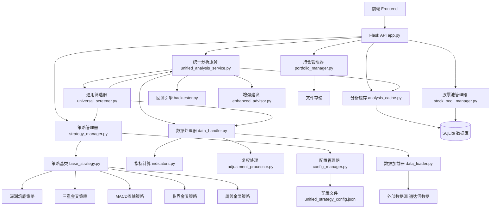

# 📊 模块依赖关系分析

## 🔗 核心模块依赖图



## 📋 模块详细分析

### 🌐 API服务层

#### `app.py` - Flask API 主服务器
**依赖模块**:
- `strategy_manager` - 策略管理
- `config_manager` - 配置管理
- `portfolio_manager` - 持仓管理
- `analysis_cache` - 缓存管理
- `universal_screener` - 筛选服务
- `data_loader`, `indicators`, `backtester` - 数据处理

**提供服务**:
- RESTful API接口
- 静态文件服务
- 跨域支持 (CORS)
- 错误处理和日志

**关键特性**:
- 优先缓存读取策略
- 多周期数据支持
- 完整的API文档

---

### 🎯 策略管理层

#### `strategy_manager.py` - 策略管理器
**依赖模块**:
- `config_manager` - 配置管理
- `strategies.base_strategy` - 策略基类
- 各具体策略模块

**核心功能**:
- 动态策略发现和注册
- 策略实例化管理
- 配置热更新
- 策略启用/禁用控制

**设计模式**: 工厂模式 + 注册模式

#### `config_manager.py` - 统一配置管理器
**依赖模块**:
- 配置文件 `unified_strategy_config.json`

**核心功能**:
- 配置文件加载和解析
- 默认配置生成
- 配置验证和更新
- 策略映射管理

---

### 🔍 筛选与分析层

#### `universal_screener.py` - 通用筛选器 (分析预热器)
**依赖模块**:
- `strategy_manager` - 获取策略实例
- `data_handler` - 数据获取
- `unified_analysis_service` - 分析预热
- `stock_pool_manager` - 股票池管理

**核心功能**:
- 多策略并行筛选
- 信号发现后立即预热缓存
- 调用统一分析服务
- 结果数据库存储

**优化特性**:
- "扫描一次，处处使用"
- 避免重复计算

#### `unified_analysis_service.py` - 统一分析服务
**依赖模块**:
- `analysis_cache` - 缓存管理
- `data_handler` - 数据处理
- `backtester` - 回测分析
- `enhanced_advisor` - 交易建议
- `strategy_manager` - 策略应用

**核心功能**:
- 清晰的单向数据流
- 数据库缓存集成
- 深度分析报告生成
- 交易建议合成

**数据流**:
```
缓存检查 → 数据获取 → 策略应用 → 回测分析 → 建议生成 → 缓存存储
```

---

### 📊 数据处理层

#### `data_handler.py` - 统一数据处理模块
**依赖模块**:
- `data_loader` - 原始数据加载
- `indicators` - 技术指标计算
- `adjustment_processor` - 复权处理
- `config` - 基础配置

**核心功能**:
- 统一数据加载入口
- 技术指标统一计算
- 多市场数据支持
- 数据质量验证

**支持格式**:
- 通达信 .day 文件
- 分时数据 .lc5 文件
- 多种复权方式

#### `data_loader.py` - 数据加载器
**依赖模块**:
- 无 (底层模块)

**核心功能**:
- 二进制数据文件解析
- 多种数据格式支持
- 数据格式转换
- 异常处理

#### `indicators.py` - 技术指标计算
**依赖模块**:
- `pandas`, `numpy` - 数据计算
- `adjustment_processor` - 复权支持

**支持指标**:
- 移动平均线 (MA)
- MACD 指标
- KDJ 指标
- RSI 指标
- 布林带 (BOLL)

#### `adjustment_processor.py` - 复权处理器
**依赖模块**:
- 无 (底层模块)

**核心功能**:
- 前复权/后复权处理
- 复权配置管理
- 价格调整计算
- 复权数据验证

---

### 🎯 策略实现层

#### `strategies/base_strategy.py` - 策略基类
**依赖模块**:
- `abc` - 抽象基类
- `pandas`, `numpy` - 数据处理

**定义接口**:
```python
@abstractmethod
def get_strategy_name(self) -> str
def get_strategy_version(self) -> str  
def apply_strategy(self, df: pd.DataFrame) -> Tuple[pd.Series, Dict]
def get_required_data_length(self) -> int
```

#### 具体策略实现
1. **`abyss_bottoming_strategy.py`** - 深渊筑底策略
   - 识别底部反转信号
   - 多阶段确认机制
   - 风险控制参数

2. **`triple_cross_strategy.py`** - 三重金叉策略
   - MA13/MA45/MACD 三重确认
   - 强势信号过滤
   - 动态参数调整

3. **`macd_zero_axis_strategy.py`** - MACD零轴策略
   - MACD零轴突破识别
   - 趋势确认机制
   - 信号强度评估

4. **`pre_cross_strategy.py`** - 临界金叉策略
   - 均线临界突破
   - 早期信号捕获
   - 假突破过滤

5. **`weekly_golden_cross_ma_strategy.py`** - 周线金叉策略
   - 周线与日线协同
   - 多周期确认
   - 长期趋势跟踪

---

### 💾 数据存储层

#### `analysis_cache.py` - 分析结果缓存系统
**依赖模块**:
- `sqlite3` - 数据库操作
- `json` - 数据序列化

**数据库表**:
- `stock_basic_info` - 股票基础信息
- `analysis_results` - 分析结果缓存

**核心功能**:
- 分析结果持久化
- 缓存命中率优化
- 过期数据清理
- 缓存统计分析

#### `stock_pool_manager.py` - 股票池管理器
**依赖模块**:
- `sqlite3` - 数据库操作
- `pandas` - 数据处理

**核心功能**:
- 核心观察池管理
- 股票评级系统
- 动态调整算法
- 参数优化

---

### 💼 业务逻辑层

#### `portfolio_manager.py` - 持仓管理器
**依赖模块**:
- `data_handler` - 数据获取
- `backtester` - 回测分析
- `enhanced_advisor` - 交易建议

**核心功能**:
- 持仓记录管理
- 风险评估分析
- 操作建议生成
- 收益统计分析

#### `backtester.py` - 回测引擎
**依赖模块**:
- `pandas`, `numpy` - 数据计算

**核心功能**:
- 历史回测分析
- 交易信号验证
- 收益率计算
- 风险指标评估

#### `enhanced_advisor.py` - 增强交易建议
**依赖模块**:
- `indicators` - 技术指标
- `backtester` - 历史表现

**核心功能**:
- 智能交易建议
- 多维度分析
- 风险评估
- 操作时机判断

---

## 🔄 模块间通信机制

### 1. 直接依赖调用
```python
# 策略管理器调用具体策略
strategy_instance = strategy_manager.get_strategy_instance(strategy_id)
signals = strategy_instance.apply_strategy(df)
```

### 2. 配置驱动通信
```python
# 通过配置管理器获取参数
config = config_manager.get_strategy_config(strategy_id)
strategy = StrategyClass(config)
```

### 3. 缓存中介通信
```python
# 通过缓存系统共享数据
cached_result = analysis_cache.get_cached_analysis(stock_code, strategy_id)
if not cached_result:
    result = compute_analysis()
    analysis_cache.save_analysis_result(result)
```

### 4. 事件驱动通信
```python
# 配置变更触发缓存清理
def on_config_update(strategy_id):
    analysis_cache.invalidate_cache(strategy_id=strategy_id)
```

## 📈 性能优化策略

### 1. 缓存层次结构
```
内存缓存 (最快) → SQLite缓存 (快) → 实时计算 (慢)
```

### 2. 数据预热机制
```
信号发现 → 立即深度分析 → 缓存存储 → 后续快速访问
```

### 3. 并行处理优化
```
多进程筛选 + 异步IO + 批量数据库操作
```

### 4. 智能缓存失效
```
配置变更 → 相关缓存清理 → 避免脏数据
```

## 🔒 模块安全性设计

### 1. 输入验证
- 所有外部输入严格验证
- 参数类型和范围检查
- SQL注入防护

### 2. 错误隔离
- 模块级异常处理
- 优雅降级机制
- 详细错误日志

### 3. 资源管理
- 数据库连接池
- 内存使用监控
- 文件句柄管理

## 🚀 扩展性考虑

### 1. 策略扩展
- 标准化策略接口
- 插件化架构
- 动态加载机制

### 2. 数据源扩展
- 适配器模式
- 统一数据接口
- 多数据源支持

### 3. 功能模块扩展
- 依赖注入
- 接口抽象
- 配置驱动

---

**文档版本**: v1.0  
**最后更新**: 2025-01-19  
**维护者**: 开发团队