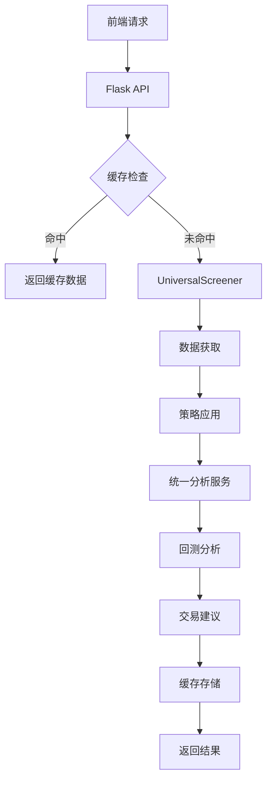

# 📊 股票筛选与分析平台 - 项目架构文档

## 🏗️ 系统架构概览

本项目是一个完整的量化交易分析平台，采用前后端分离架构，集成了多策略筛选、持仓管理、多周期分析等功能。

### 核心设计理念
- **模块化设计**: 每个功能独立模块，便于维护和扩展
- **配置驱动**: 所有参数通过配置文件管理，支持热更新
- **缓存优化**: "扫描一次，处处使用"的高效架构
- **策略解耦**: 策略与数据分离，逻辑与显示分离

## 📁 项目目录结构

```
股票筛选与分析平台/
├── 📂 backend/                          # 后端核心模块
│   ├── 🌐 app.py                       # Flask API 主服务器
│   ├── ⚙️ config_manager.py            # 统一配置管理器
│   ├── 🎯 strategy_manager.py          # 策略管理器
│   ├── 🔍 universal_screener.py        # 通用筛选框架 (已升级为分析预热器)
│   ├── 📊 unified_analysis_service.py  # 统一分析服务
│   ├── 💾 analysis_cache.py            # 分析结果缓存系统
│   ├── 📈 data_handler.py              # 统一数据处理模块
│   ├── 💼 portfolio_manager.py         # 持仓管理器
│   ├── 🏦 stock_pool_manager.py        # 股票池管理器
│   ├── 🧮 backtester.py               # 回测引擎
│   ├── 📉 indicators.py               # 技术指标计算
│   ├── 🔧 adjustment_processor.py      # 复权处理器
│   ├── 🤖 enhanced_advisor.py          # 增强交易建议
│   ├── 📂 strategies/                  # 策略模块目录
│   │   ├── 🎯 base_strategy.py         # 策略基类
│   │   ├── 🌊 abyss_bottoming_strategy.py    # 深渊筑底策略
│   │   ├── ⚡ triple_cross_strategy.py       # 三重金叉策略
│   │   ├── 📊 macd_zero_axis_strategy.py     # MACD零轴策略
│   │   ├── 🔄 pre_cross_strategy.py         # 临界金叉策略
│   │   └── 📅 weekly_golden_cross_ma_strategy.py # 周线金叉策略
│   └── 📂 data/                        # 数据存储目录
├── 📂 frontend/                         # 前端界面
│   ├── 🏠 index.html                   # 主页面
│   └── 📂 js/
│       └── 🎨 app.js                   # 前端逻辑
├── 📂 config/                          # 配置文件目录
│   └── ⚙️ unified_strategy_config.json # 统一策略配置
├── 📂 data/                            # 数据存储
│   ├── 📊 quant_analysis.db           # SQLite 分析缓存数据库
│   └── 📂 result/                     # 分析结果输出
└── 📂 doc/                            # 文档目录
    └── 📋 各种修复和实现文档
```

## 🔧 核心模块架构

### 1. 🌐 API 服务层 (`app.py`)
**职责**: Flask Web服务器，提供RESTful API接口

**核心功能**:
- 策略管理API (`/api/strategies/`)
- 股票分析API (`/api/analysis/`)
- 持仓管理API (`/api/portfolio/`)
- 核心池管理API (`/api/core_pool/`)
- 交易建议API (`/api/trading_advice/`)

**关键特性**:
- 优先从缓存读取数据，提升响应速度
- 支持多周期数据分析 (5分钟到日线)
- 完整的错误处理和日志记录

### 2. 🎯 策略管理层 (`strategy_manager.py`)
**职责**: 动态加载和管理所有交易策略

**核心功能**:
- 自动发现策略模块
- 策略实例化和配置管理
- 策略启用/禁用控制
- 策略配置热更新

**设计模式**: 工厂模式 + 注册模式

### 3. 🔍 筛选引擎层 (`universal_screener.py`)
**职责**: 通用股票筛选器，已升级为"分析预热器"

**核心功能**:
- 多策略并行筛选
- 信号发现后立即预热缓存
- 调用统一分析服务进行深度分析
- 结果存入数据库缓存

**优化特性**:
- "扫描一次，处处使用"架构
- 避免重复计算，提升系统性能

### 4. 📊 统一分析服务 (`unified_analysis_service.py`)
**职责**: 核心分析引擎，实现清晰的单向数据流

**核心功能**:
- 集成数据库缓存机制
- 技术指标计算
- 回测分析
- 交易建议生成
- 深度分析报告

**数据流**:
```
数据获取 → 策略应用 → 回测分析 → 交易建议 → 缓存存储
```

### 5. 💾 缓存系统 (`analysis_cache.py`)
**职责**: SQLite数据库缓存管理

**核心功能**:
- 分析结果持久化存储
- 按策略和日期索引
- 缓存命中率优化
- 过期数据清理

**数据库表结构**:
- `stock_basic_info`: 股票基础信息
- `analysis_results`: 分析结果缓存

### 6. 📈 数据处理层 (`data_handler.py`)
**职责**: 统一的股票数据加载和处理

**核心功能**:
- 多市场数据支持 (沪深港)
- 技术指标统一计算
- 复权处理
- 数据质量验证

### 7. 💼 持仓管理 (`portfolio_manager.py`)
**职责**: 投资组合管理和分析

**核心功能**:
- 持仓记录管理
- 风险评估
- 操作建议生成
- 收益分析

### 8. 🏦 股票池管理 (`stock_pool_manager.py`)
**职责**: 核心观察池数据库管理

**核心功能**:
- SQLite数据库持久化
- 股票评级管理
- 动态调整算法
- 参数优化

## 🔄 系统数据流

### 主要数据流向


### 缓存优化流程


## 🎯 策略架构

### 策略基类设计 (`base_strategy.py`)
```python
class BaseStrategy(ABC):
    @abstractmethod
    def get_strategy_name(self) -> str
    
    @abstractmethod
    def apply_strategy(self, df: pd.DataFrame) -> Tuple[pd.Series, Dict]
    
    @abstractmethod
    def get_required_data_length(self) -> int
```

### 已实现策略
1. **🌊 深渊筑底策略** - 识别底部反转信号
2. **⚡ 三重金叉策略** - MA13/MA45/MACD三重确认
3. **📊 MACD零轴策略** - MACD零轴突破
4. **🔄 临界金叉策略** - 均线临界突破
5. **📅 周线金叉策略** - 周线与日线协同

## 🔧 配置管理架构

### 统一配置文件 (`unified_strategy_config.json`)
```json
{
  "version": "2.0",
  "strategies": {
    "策略ID": {
      "name": "策略名称",
      "enabled": true,
      "parameters": {...}
    }
  },
  "global_settings": {...},
  "market_filters": {...}
}
```

### 配置管理器特性
- 热更新支持
- 版本控制
- 参数验证
- 默认值回退

## 💾 数据库架构

### SQLite 缓存数据库 (`quant_analysis.db`)

#### 表结构
```sql
-- 股票基础信息表
CREATE TABLE stock_basic_info (
    stock_code TEXT PRIMARY KEY,
    stock_name TEXT,
    sector TEXT,
    last_updated TEXT
);

-- 分析结果缓存表
CREATE TABLE analysis_results (
    stock_code TEXT,
    strategy_id TEXT,
    analysis_date TEXT,
    backtest_result TEXT,
    deep_analysis_result TEXT,
    chart_data TEXT,
    created_at TEXT,
    PRIMARY KEY (stock_code, strategy_id, analysis_date)
);
```

#### 索引优化
- `idx_analysis_date`: 按日期查询优化
- `idx_created_at`: 按创建时间查询优化

## 🚀 性能优化特性

### 1. 缓存优化
- **数据库缓存**: SQLite持久化存储
- **内存缓存**: 热数据内存缓存
- **智能失效**: 配置变更自动清理相关缓存

### 2. 并行处理
- **多进程筛选**: CPU密集型任务并行化
- **异步IO**: 数据加载异步处理
- **批量操作**: 数据库批量读写

### 3. 数据预热
- **预热机制**: 筛选时立即进行深度分析
- **后台处理**: 非阻塞式数据处理
- **智能调度**: 根据使用频率调整预热策略

## 🔌 API 接口设计

### RESTful API 规范
```
GET    /api/strategies                    # 获取策略列表
GET    /api/strategies/{id}/stocks        # 获取策略股票
GET    /api/analysis/{stock_code}         # 获取股票分析
GET    /api/trading_advice/{stock_code}   # 获取交易建议
POST   /api/portfolio                     # 添加持仓
PUT    /api/portfolio                     # 更新持仓
DELETE /api/portfolio                     # 删除持仓
```

### 响应格式标准
```json
{
  "success": true,
  "data": {...},
  "error": null,
  "timestamp": "2025-01-19T10:30:00Z"
}
```

## 🔒 安全与稳定性

### 错误处理
- 全局异常捕获
- 详细错误日志
- 优雅降级机制
- 用户友好错误信息

### 数据验证
- 输入参数验证
- 数据类型检查
- 范围边界验证
- SQL注入防护

### 监控与日志
- 结构化日志记录
- 性能指标监控
- 错误率统计
- 缓存命中率跟踪

## 🔄 扩展性设计

### 策略扩展
- 插件化策略架构
- 标准化策略接口
- 动态策略加载
- 策略版本管理

### 数据源扩展
- 多数据源适配器
- 统一数据接口
- 数据源切换
- 实时数据支持

### 功能模块扩展
- 模块化设计
- 标准化接口
- 依赖注入
- 配置驱动

## 📈 未来发展方向

### 短期优化
1. **实时数据**: 集成实时行情数据
2. **移动端**: 响应式前端设计
3. **通知系统**: 信号推送和提醒
4. **报告生成**: 自动化分析报告

### 长期规划
1. **机器学习**: AI驱动的策略优化
2. **云部署**: 容器化和云原生架构
3. **多资产**: 支持期货、期权等多资产类别
4. **社区功能**: 策略分享和讨论平台

## 🛠️ 开发与维护

### 代码规范
- PEP 8 Python代码规范
- 类型注解 (Type Hints)
- 文档字符串 (Docstrings)
- 单元测试覆盖

### 版本控制
- Git 版本管理
- 语义化版本号
- 变更日志维护
- 分支管理策略

### 部署流程
- 环境配置管理
- 数据库迁移脚本
- 配置文件模板
- 监控和告警设置

---

## 📞 技术支持

如需技术支持或有任何问题，请参考项目文档或联系开发团队。

**最后更新**: 2025-01-19
**文档版本**: v2.0
**系统版本**: v2.0