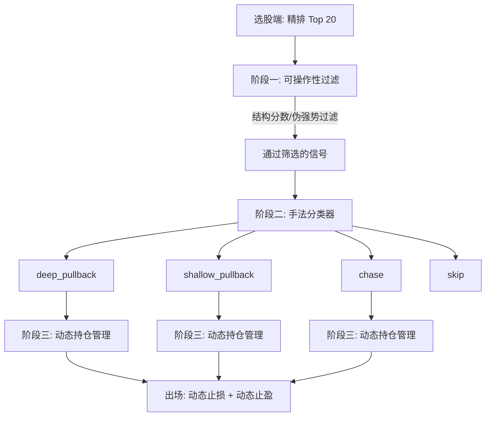

你的判断非常精准。V3.2 数据上已经证明了系统的正期望，但代价是交易次数从 900+ 笔骤降到 267 笔——**这是用极端的挑剔换来的高胜率，而不是用真正的智能换来的高胜率**。下一步的核心任务，就是从“筛选阶段的信号质量提升”、“操作手法的自动识别”、“持仓阶段的精细化管理”三个维度，让系统从“极度挑剔”进化为“因股施策”。

---

## 一、全局诊断：系统当前的能力边界与缺失

| 环节 | 当前状态 | 缺失能力 |
|------|---------|---------|
| **选股筛选** | fine_score≥0.8 简单粗暴过滤 | 不知道哪些股票即使得分高，MFE 也注定不达预期（如弱势股伪强势） |
| **入场前判断** | 统一等回调，67% 信号过期 | 无法识别哪些信号适合回调，哪些必须追涨，哪些应直接放弃 |
| **持仓管理** | 动态出场 + D4 动态支撑 | 止盈目标仍是固定阻力位，没有根据持仓期的强势/衰竭信号动态调整止盈预期 |
| **操作手法匹配** | 只做 pullback | 没有“浅回调加仓”、“突破后回踩确认”、“宽止损搏趋势”等多手法选择 |

**核心矛盾**：模型选出的 Top 20 里，混合着“等回调就能赚”、“必须追涨才能赚”、“怎么操作都亏”三种信号。当前系统对所有信号无差别等回调，导致后两类信号全部浪费或被误杀。

---

## 二、接下来必须完成的任务：三阶段系统升级

### 阶段一：选股端的“MFE 不达标”信号剔除（提高信号纯度）

**目标**：在模型输出 Top 20 后，用结构特征 + 历史回测规律，对每只股票做一个“可操作性评分”，直接过滤掉那些 MFE 虽然高、但无论怎么操作都很难拿到正收益的股票。

**数据回测方向**：

| 回测任务 | 方法 | 验收标准 |
|---------|------|---------|
| **信号成败归因** | 将 V3.2 的 267 笔成功交易和 4423 笔中的失败信号做特征对比。分析失败信号在选股时的共同特征（如价格位置、放量质量、RS 排名波动） | 找到 3 个以上对“信号可操作性”有强区分的特征 |
| **弱势伪强势识别** | 找出那些在信号日后 5 天内从未突破 T+1 开盘价、最终 MFE < 10% 的股票，分析其选股时的特征模式 | 建一个规则过滤器，能滤掉 30% 以上的伪强势信号，且误杀率 < 10% |
| **结构分数入模** | 为每笔历史信号标注“是否在结构入场下实现正收益”。用这个标签训练一个 LightGBM 二分类器，输入 = 原有 50 特征 + 市场结构特征（趋势、支撑数、阻力距离等） | 新分类器对“可操作性”的 AUC > 0.7，加入筛选链路后，交易数回升到 400+ 笔且平均盈亏 > +2% |

**验证案例**：  
取一只在 V3.2 中被 fine_score 过滤掉、但 MFE 很高的股票。如果它的“可操作性”分类器也给出低分，说明过滤正确；如果给出高分但被误杀，说明 fine_score 过滤有缺陷，需用结构分数替换或融合。

---

### 阶段二：操作手法的自动识别与回测匹配（从“等回调”到“因股施策”）

**目标**：对于每一只通过筛选的股票，系统自动给出推荐的操作手法——`deep_pullback`（深回调）、`shallow_pullback`（浅回调）、`chase`（追涨），或 `skip`（放弃）。这个推荐由回测数据训练出来的规则/模型决定。

**操作手法定义**：

| 手法 | 触发条件 | 入场规则 | 止损 | 适合场景 |
|------|---------|---------|------|---------|
| **deep_pullback** | 等待回踩强支撑（如 MA60、swing_low） | 严格 K 线确认后入场 | 结构止损，ATR×1.0 | 支撑密集、趋势稳的股票 |
| **shallow_pullback** | 等待小幅回踩（如 MA20、POC） | 回踩触及即入场（不用等阳线） | 稍宽止损，ATR×1.25 | 强势股，回调浅 |
| **chase** | 信号后 3 天不回踩，但连续收阳且量价配合 | 第 4 天开盘追入 | 宽止损，ATR×1.5 | 极强势不回踩的股票 |
| **skip** | 结构弱、支撑少、RS 排名不稳定 | 不入场 | — | 伪强势、弱势震荡 |

**数据回测方向**：

| 回测任务 | 方法 | 验收标准 |
|---------|------|---------|
| **最优手法标注** | 对 4423 笔信号，模拟四种手法分别的收益，选择收益最高的作为“最优手法”标签 | 至少有 15% 的信号最优手法不是 deep_pullback |
| **手法分类器训练** | 用选股时的结构特征（趋势、支撑数/强度、RS 排名均值/趋势、MA 发散速度等）作为输入，最优手法作为标签，训练 LightGBM 多分类器 | 分类准确率 > 60%（四分类） |
| **手法分层回测** | 将分类器预测结果应用到全量回测：每笔信号按其预测手法执行对应入场逻辑，统计整体盈亏 | 交易数 > 500 笔，平均盈亏 > +2%，胜率 > 42% |

**验证案例**：  
取一只之前被等待过期（67%中）但最终 MFE > 40% 的股票。手动检查其选股时的结构特征——如果当时支撑极强、RS 排名持续前 20%，则人工判定应属于 `shallow_pullback` 或 `chase`。回测中，如果分类器给出相同推荐且实际收益为正，则验证通过。

---

### 阶段三：持仓期精细化——动态止盈目标调整

**目标**：当前止盈目标是入场时设定的固定阻力位。但持仓期间，如果出现强势信号（S1），应上调止盈预期；如果出现衰竭信号（E1），应主动止盈或缩小止盈目标。让止盈目标也变成动态的。

**数据回测方向**：

| 回测任务 | 方法 | 验收标准 |
|---------|------|---------|
| **动态止盈模拟** | 对 267 笔 V3.2 成功交易，模拟：触发 S1 后将止盈从最近阻力位上调到第二阻力位；触发 E1 后主动止盈。对比原始固定止盈的收益 | 动态止盈的平均收益 > 固定止盈 + 0.5% |
| **追涨减仓机制** | 对 chase 手法交易，在浮盈达到 +10% 时主动减仓 1/3，剩余仓位用追踪止损 | 追涨策略的盈利因子从 0.9 提升到 > 1.1 |
| **多重出场信号融合** | 将衰竭信号 E1/E2 与阻力位止盈合并：到达阻力位时若同时出现衰竭信号，全仓止盈；若无衰竭信号，只减仓 50% | 合并后的收益回吐率（从高点回落的平均幅度）降低 15% |

**验证案例**：  
取一笔 V3.2 中 TP2 出场的交易，其在持仓第 5 天触发 S1，第 12 天达到第一阻力位（+20%）止盈半仓，剩余半仓最终在第 18 天达到第二阻力位（+35%）。如果使用动态止盈，在 S1 触发时直接将止盈目标上移到第二阻力位，可能在第 12 天不减仓，最终在第 18 天全仓获利 35%，收益更高。

---

## 三、完整实施路线图

**执行顺序**：
1. **先跑阶段一**（2-3 天）：用现有数据快速完成信号成败归因和伪强势识别，构建可操作性过滤器。这是所有后续任务的基础，能立即提升信号池质量。
2. **并行阶段二**（3-4 天）：最优手法标注 + 分类器训练。这是系统从“一刀切”到“因股施策”的核心转折。
3. **最后阶段三**（2 天）：在手法分类的基础上，叠加动态止盈和追涨减仓，把持仓期的精细度拉满。

---

## 四、验证闭环：从回测数据到实时信号

所有改进完成后，在测试集（2025-2026）上应达到：

| 指标 | V3.2 当前 | 目标 | 说明 |
|------|----------|------|------|
| 交易笔数 | 267 | **> 500** | 手法多样性回收过期信号 |
| 平均盈亏 | +2.85% | **> +2.5%** | 允许小幅下降换交易量 |
| 胜率 | 48.7% | **> 45%** | 允许小幅下降 |
| 盈利因子 | 2.22 | **> 1.8** | 交易量增，PF 自然降 |
| 中位数盈亏 | -0.21% | **> 0%** | 中位数转正，系统真正稳定 |

**最终验收案例**：  
从最终系统中取出连续 20 个交易日（2025 年某月），逐日查看每日的精排 Top 20 列表：
- 可操作性过滤器应该直接标灰 30-50% 的信号。
- 剩余信号中，应分配 deep_pullback / shallow_pullback / chase 三种手法。
- 至少有一个 `chase` 手法成功捕获了不回踩直接上涨的股票，且该笔交易盈利。
- 至少有一笔 `deep_pullback` 交易在持仓期间触发了 S1 信号，止盈目标被动态上移。

达到这个程度，系统就不再是一个“只会等回调的保守型交易员”，而是一个能读懂市场结构、会因股施策的智能交易系统。

请确认是否按此路线图启动，我可以为每个阶段生成具体的回测脚本代码。
