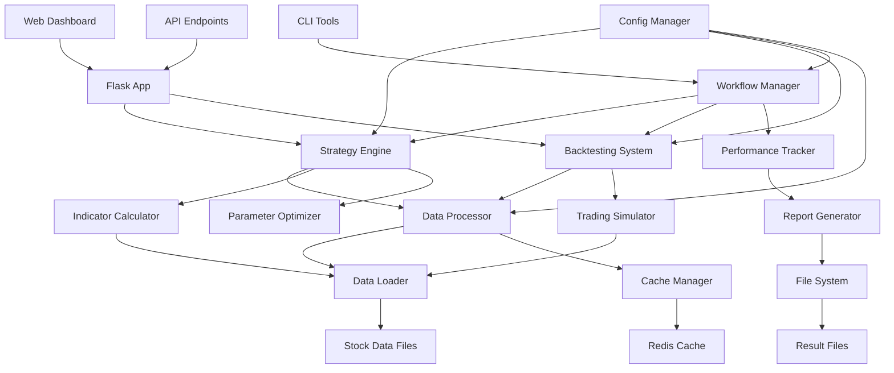

# 模块依赖关系

## 🔗 依赖关系图



## 📦 核心模块详解

### 1. 工作流管理层

#### WorkflowManager (workflow_manager.py)
**依赖模块**:
- `ConfigManager`: 配置管理
- `StockPoolManager`: 股票池管理
- `ParameterOptimizer`: 参数优化
- `DailySignalScanner`: 信号扫描
- `PerformanceTracker`: 性能跟踪

**被依赖模块**:
- `run_workflow.py`: 主控脚本
- `quick_start.py`: 演示脚本

```python
# 依赖关系示例
class WorkflowManager:
    def __init__(self):
        self.config_manager = ConfigManager()
        self.stock_pool_manager = StockPoolManager()
        self.parameter_optimizer = ParameterOptimizer()
        self.signal_scanner = DailySignalScanner()
        self.performance_tracker = PerformanceTracker()
```

#### ConfigManager (config_manager.py)
**依赖模块**:
- `json`: 配置文件解析
- `logging`: 日志记录

**被依赖模块**:
- `WorkflowManager`: 工作流管理
- `StrategyEngine`: 策略引擎
- `BacktestingSystem`: 回测系统

### 2. 策略分析层

#### StrategyEngine (strategies.py)
**依赖模块**:
- `IndicatorCalculator`: 技术指标计算
- `DataLoader`: 数据加载
- `ConfigManager`: 配置管理
- `WinRateFilter`: 胜率过滤

**被依赖模块**:
- `Screener`: 批量筛选
- `TradingAdvisor`: 交易建议
- `BacktestingSystem`: 回测系统

```python
# 策略引擎依赖关系
class StrategyEngine:
    def __init__(self):
        self.indicator_calc = IndicatorCalculator()
        self.data_loader = DataLoader()
        self.config_manager = ConfigManager()
        self.win_rate_filter = WinRateFilter()
```

#### ParameterOptimizer (parallel_optimizer.py)
**依赖模块**:
- `StrategyEngine`: 策略执行
- `BacktestingSystem`: 回测验证
- `multiprocessing`: 并行计算

**被依赖模块**:
- `WorkflowManager`: 工作流管理
- `ConfigTool`: 配置工具

### 3. 回测系统层

#### BacktestingSystem (backtester.py)
**依赖模块**:
- `DataLoader`: 历史数据加载
- `StrategyEngine`: 策略执行
- `PerformanceAnalyzer`: 性能分析
- `TradingSimulator`: 交易模拟

**被依赖模块**:
- `WorkflowManager`: 工作流管理
- `ParameterOptimizer`: 参数优化
- `ReportGenerator`: 报告生成

#### T1IntelligentTradingSystem (t1_intelligent_trading_system.py)
**依赖模块**:
- `IndicatorCalculator`: 技术指标
- `MarketAnalyzer`: 市场分析
- `RiskController`: 风险控制

**被依赖模块**:
- `IntegratedT1Backtester`: 集成回测
- `TradingAdvisor`: 交易建议

### 4. 数据处理层

#### DataLoader (data_loader.py)
**依赖模块**:
- `pandas`: 数据处理
- `numpy`: 数值计算
- `os`: 文件系统操作

**被依赖模块**:
- `StrategyEngine`: 策略分析
- `BacktestingSystem`: 回测系统
- `IndicatorCalculator`: 指标计算
- `Screener`: 批量筛选

#### IndicatorCalculator (indicators.py)
**依赖模块**:
- `pandas`: 数据处理
- `numpy`: 数值计算
- `talib`: 技术分析库 (可选)

**被依赖模块**:
- `StrategyEngine`: 策略分析
- `T1IntelligentTradingSystem`: T+1交易系统
- `BacktestingSystem`: 回测系统

### 5. 辅助系统层

#### ReportGenerator (report_generator.py)
**依赖模块**:
- `json`: 数据序列化
- `datetime`: 时间处理
- `matplotlib`: 图表生成 (可选)

**被依赖模块**:
- `WorkflowManager`: 工作流管理
- `BacktestingSystem`: 回测系统

#### NotificationSystem (notification_system.py)
**依赖模块**:
- `smtplib`: 邮件发送
- `requests`: HTTP请求

**被依赖模块**:
- `WorkflowManager`: 工作流管理
- `TradingAdvisor`: 交易建议

## 🔄 依赖层次结构

### 第一层：基础设施层
```
DataLoader ← CacheManager ← ConfigManager
```
- 提供基础的数据访问和配置管理功能
- 不依赖其他业务模块
- 被所有上层模块依赖

### 第二层：核心服务层
```
IndicatorCalculator ← StrategyEngine ← ParameterOptimizer
```
- 依赖基础设施层
- 提供核心的计算和分析功能
- 被业务逻辑层依赖

### 第三层：业务逻辑层
```
BacktestingSystem ← TradingSystem ← WorkflowManager
```
- 依赖核心服务层
- 实现具体的业务逻辑
- 被用户界面层调用

### 第四层：用户界面层
```
CLI Tools ← Web Dashboard ← API Endpoints
```
- 依赖业务逻辑层
- 提供用户交互接口
- 不被其他模块依赖

## 📋 依赖管理策略

### 1. 依赖注入
```python
class StrategyEngine:
    def __init__(self, data_loader=None, indicator_calc=None):
        self.data_loader = data_loader or DataLoader()
        self.indicator_calc = indicator_calc or IndicatorCalculator()
```

### 2. 工厂模式
```python
class ComponentFactory:
    @staticmethod
    def create_strategy_engine(config):
        data_loader = DataLoader(config.data_path)
        indicator_calc = IndicatorCalculator(config.indicator_params)
        return StrategyEngine(data_loader, indicator_calc)
```

### 3. 单例模式
```python
class ConfigManager:
    _instance = None
    
    def __new__(cls):
        if cls._instance is None:
            cls._instance = super().__new__(cls)
        return cls._instance
```

## 🔧 循环依赖处理

### 1. 接口抽象
```python
from abc import ABC, abstractmethod

class DataProviderInterface(ABC):
    @abstractmethod
    def load_data(self, symbol: str) -> pd.DataFrame:
        pass

class StrategyInterface(ABC):
    @abstractmethod
    def analyze(self, data: pd.DataFrame) -> dict:
        pass
```

### 2. 事件驱动
```python
class EventBus:
    def __init__(self):
        self.subscribers = {}
    
    def subscribe(self, event_type, callback):
        if event_type not in self.subscribers:
            self.subscribers[event_type] = []
        self.subscribers[event_type].append(callback)
    
    def publish(self, event_type, data):
        for callback in self.subscribers.get(event_type, []):
            callback(data)
```

### 3. 延迟加载
```python
class LazyLoader:
    def __init__(self, module_name, class_name):
        self.module_name = module_name
        self.class_name = class_name
        self._instance = None
    
    def get_instance(self):
        if self._instance is None:
            module = __import__(self.module_name)
            cls = getattr(module, self.class_name)
            self._instance = cls()
        return self._instance
```

## 📊 依赖分析工具

### 1. 依赖检查脚本
```python
def analyze_dependencies():
    """分析模块依赖关系"""
    import ast
    import os
    
    dependencies = {}
    for root, dirs, files in os.walk('backend'):
        for file in files:
            if file.endswith('.py'):
                filepath = os.path.join(root, file)
                deps = extract_imports(filepath)
                dependencies[file] = deps
    
    return dependencies

def extract_imports(filepath):
    """提取文件中的import语句"""
    with open(filepath, 'r', encoding='utf-8') as f:
        tree = ast.parse(f.read())
    
    imports = []
    for node in ast.walk(tree):
        if isinstance(node, ast.Import):
            for alias in node.names:
                imports.append(alias.name)
        elif isinstance(node, ast.ImportFrom):
            imports.append(node.module)
    
    return imports
```

### 2. 循环依赖检测
```python
def detect_circular_dependencies(dependencies):
    """检测循环依赖"""
    def dfs(node, path, visited):
        if node in path:
            cycle_start = path.index(node)
            return path[cycle_start:] + [node]
        
        if node in visited:
            return None
        
        visited.add(node)
        path.append(node)
        
        for dep in dependencies.get(node, []):
            cycle = dfs(dep, path, visited)
            if cycle:
                return cycle
        
        path.pop()
        return None
    
    for module in dependencies:
        cycle = dfs(module, [], set())
        if cycle:
            print(f"发现循环依赖: {' -> '.join(cycle)}")
```

## 🎯 最佳实践

### 1. 依赖最小化
- 只导入必要的模块
- 使用接口抽象减少具体依赖
- 避免不必要的传递依赖

### 2. 依赖稳定化
- 依赖稳定的接口而非具体实现
- 使用版本控制管理依赖变更
- 定期审查和清理无用依赖

### 3. 依赖测试
- 为每个依赖关系编写测试
- 使用Mock对象隔离依赖
- 定期运行依赖分析工具

### 4. 文档维护
- 及时更新依赖关系文档
- 记录重要的依赖变更
- 提供依赖关系可视化图表

这个依赖关系设计确保了系统的模块化、可维护性和可扩展性，为系统的长期发展奠定了坚实的基础。