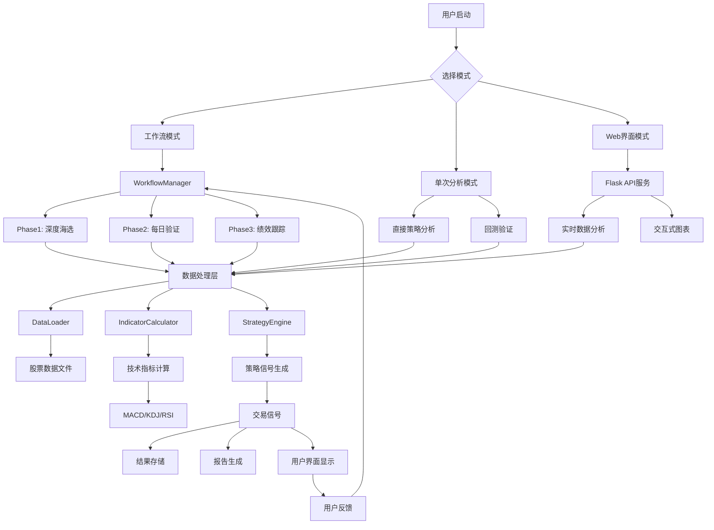
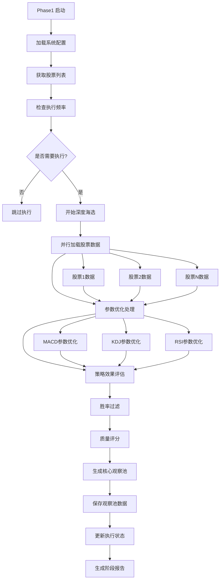
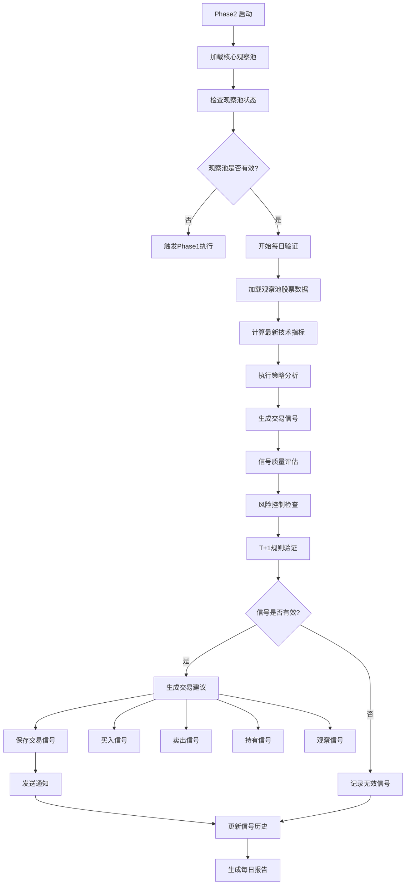
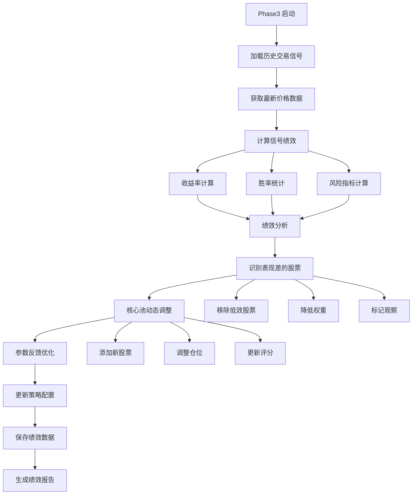
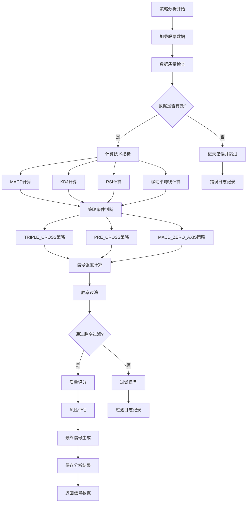
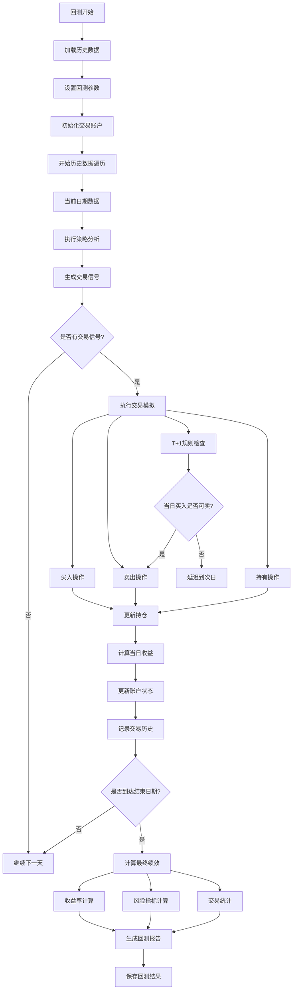
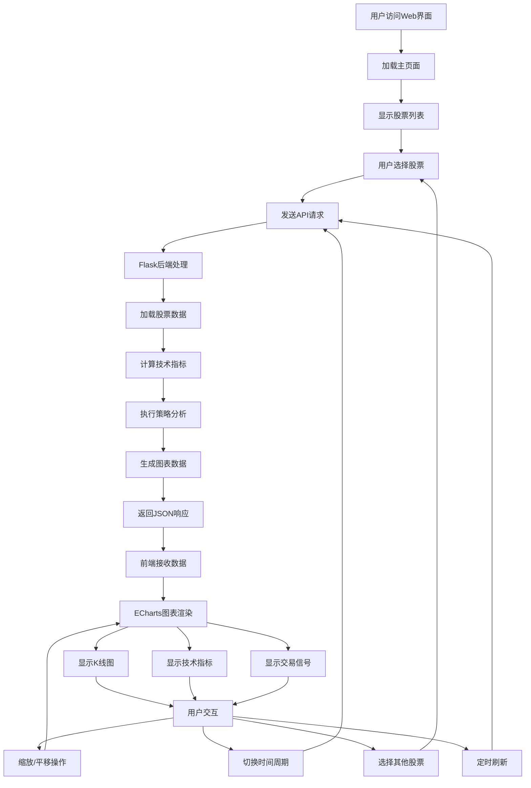
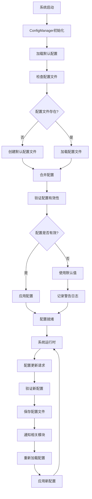
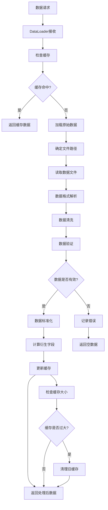
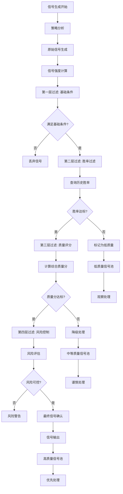

# 系统整体流程图

## 🔄 系统总体架构流程

## 📊 三阶段工作流详细流程

### Phase 1: 深度海选与参数优化

### Phase 2: 每日验证与信号触发

### Phase 3: 绩效跟踪与反馈

## 🎯 策略分析流程

## 🔄 回测系统流程

## 📱 Web界面交互流程

## 🔧 配置管理流程

## 📊 数据处理流程

## 🎯 信号生成与过滤流程

这些流程图详细展示了系统各个层面的处理逻辑，为开发者理解系统运行机制和进行问题排查提供了清晰的指导。每个流程都包含了错误处理和异常情况的处理路径，确保系统的健壮性和可靠性。